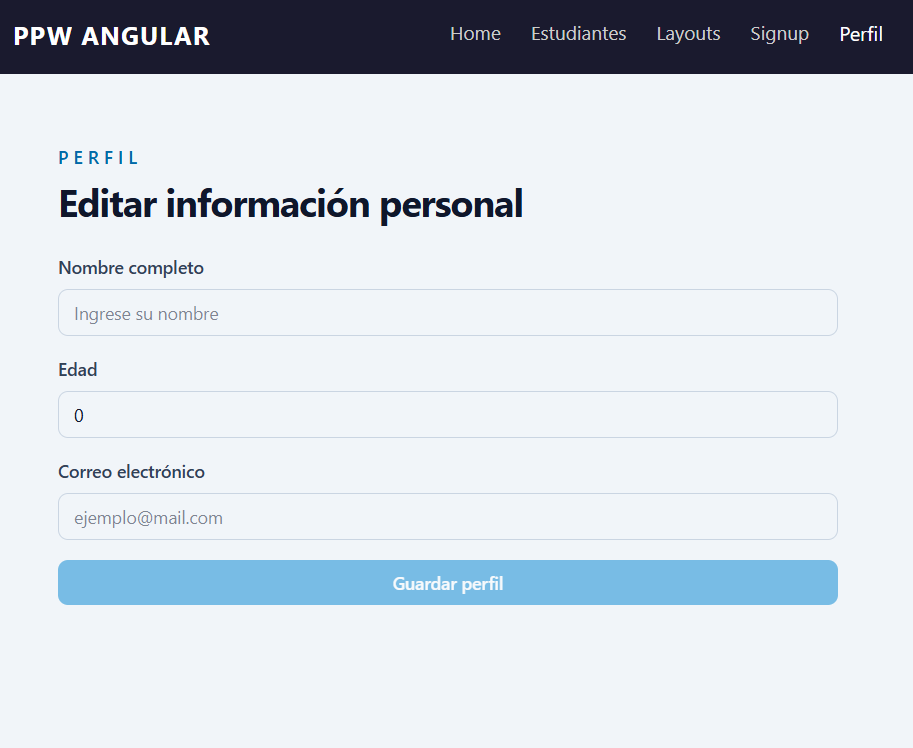
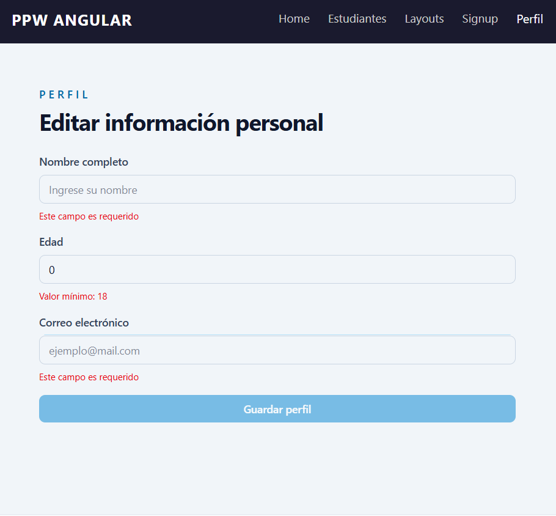
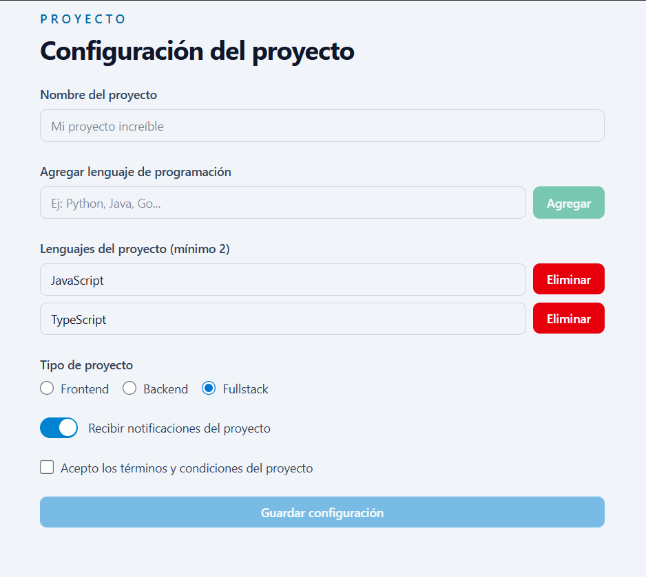
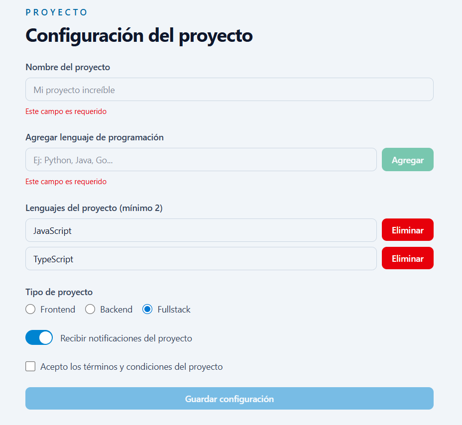
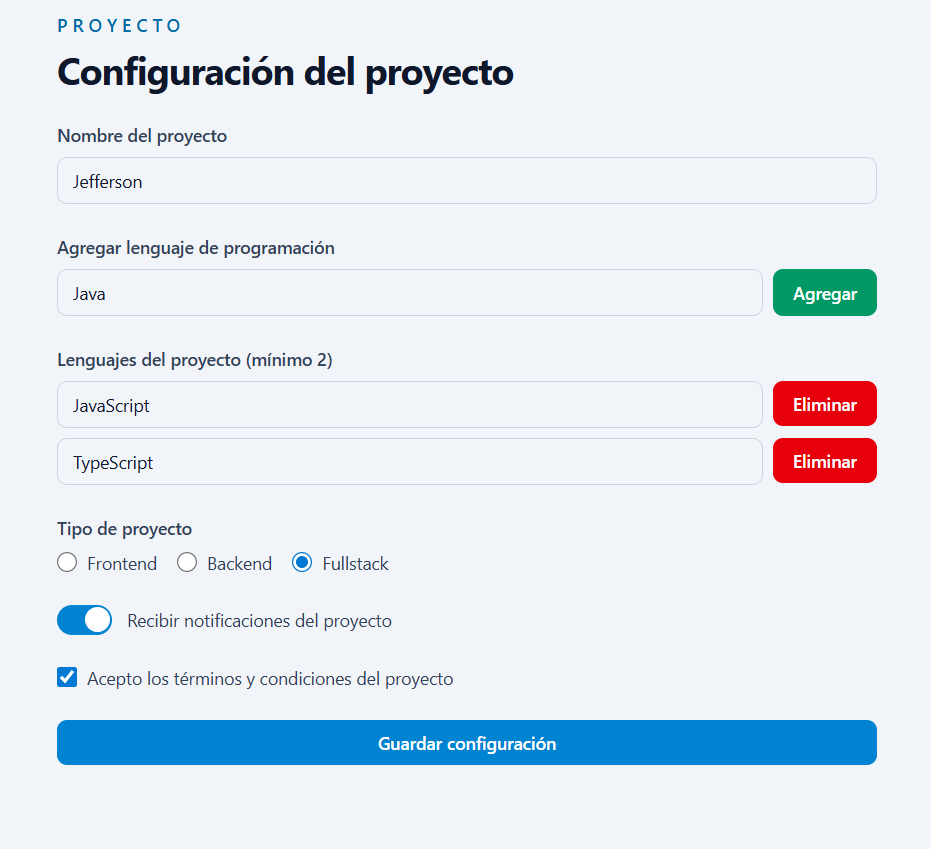
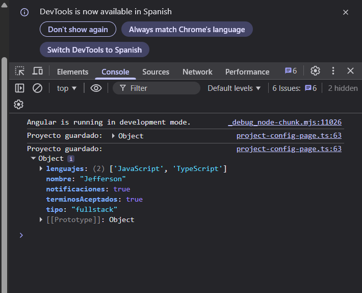

# Fundamentos de Angular

Proyecto desarrollado para la materia de Programación y Plataformas Web utilizando Angular 21 y TailwindCSS.

---

# Página principal

Vista inicial de la aplicación:

---

# 05. Formularios Reactivos - Práctica A

## Formulario Sign Up con validaciones

---

# 05. Formularios Reactivos - Práctica B

## Estado inicial del formulario

El formulario inicia vacío y con estado `INVALID`.

## Formulario mostrando errores

Visualización dinámica de errores utilizando la clase `FormUtils`.

# 05. Formularios Reactivos - Práctica C
##  Formulario vacío

##  Errores de validación

## Formulario válido y datos completos

## Consola con el objeto myForm.value

